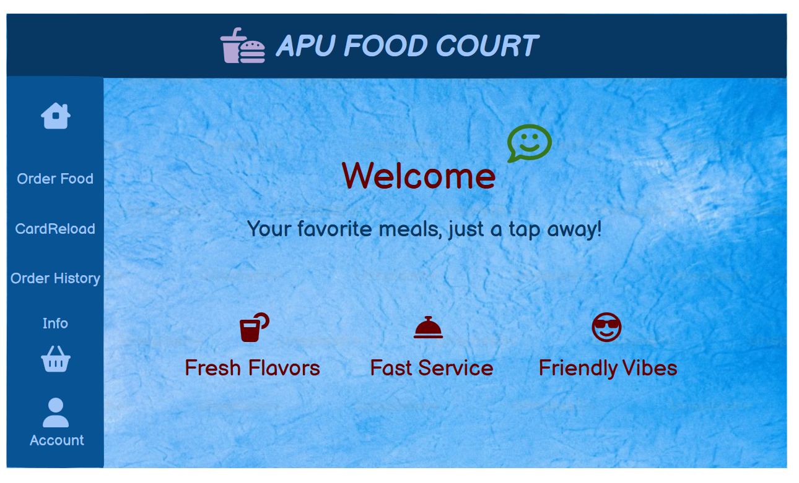
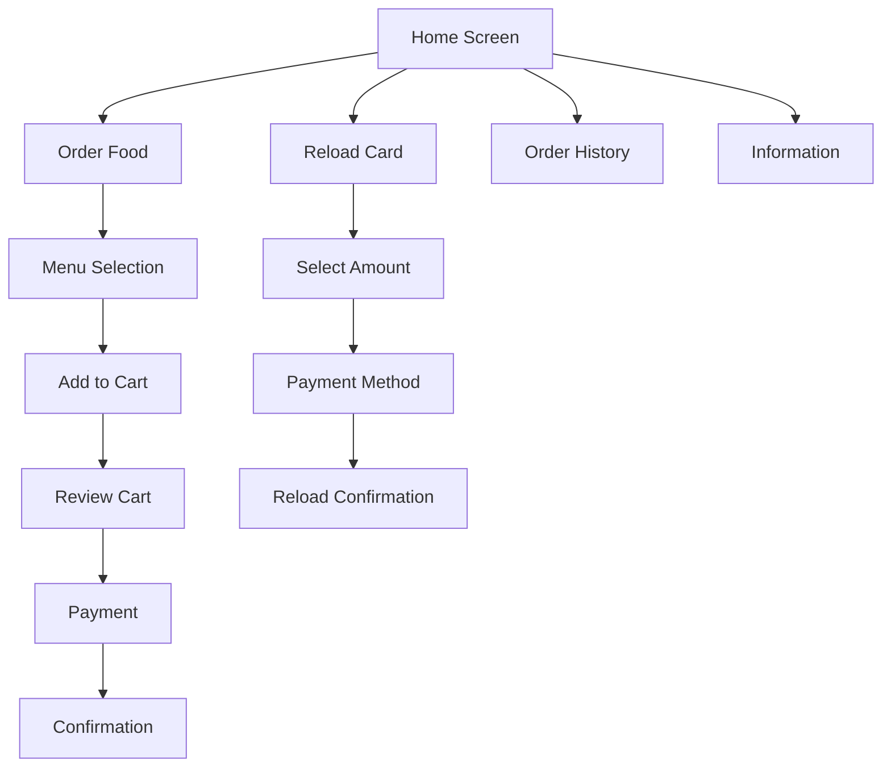

# APU Food Court Kiosk System - Wireframes



A complete set of wireframes for the APU Food Court self-service kiosk system, designed in Balsamiq.

## Table of Contents
- [Project Overview](#project-overview)
- [Wireframe Screens](#wireframe-screens)
- [User Flow](#user-flow)
- [Features](#features)
- [Technology](#technology)
- [Installation](#installation)
- [Contributing](#contributing)
- [License](#license)

## Project Overview

The APU Food Court Kiosk System is designed to streamline food ordering and payment processes at the Asia Pacific University (APU) campus. These wireframes represent the user interface for the self-service kiosks that will be installed in the food court.

**Key Objectives**:
- Allow students/staff to order food using their campus cards
- Enable card balance reloading
- Provide order history tracking
- Reduce queues and waiting times

## Wireframe Screens

📽️ **Watch the complete wireframe walkthrough video below:**

)


| Screen | Description |
|--------|-------------|
| **Home** | Main landing page with navigation options |
| **Menu** | Food selection interface with categories |
| **Cart** | Order summary and payment initiation |
| **Payment** | Multiple payment method options |
| **Confirmation** | Order success with collection details |
| **Reload Card** | Add credit to student/staff card |
| **Order History** | View past orders and receipts |
| **Information** | Food court details and help |

## User Flow



## Features

- **Intuitive Interface**: Touch-friendly design for kiosk use
- **Multiple Payment Options**: Card balance, cash, e-wallet, QR pay
- **Real-time Updates**: Menu availability and preparation time
- **Accessibility**: Clear visual hierarchy and contrast
- **Brand Consistency**: APU color scheme and styling

## Technology

- **Design Tool**: Balsamiq Wireframes
- **Version Control**: GitHub
- **Documentation**: Markdown

## Installation

To view or edit these wireframes:

1. Clone this repository:
   ```bash
   git clone https://github.com/your-username/APU-FoodCourt-Kiosk-Wireframes.git
   ```
2. Open the `.bmpr` file in Balsamiq Wireframes
3. Export updated versions as needed

## Contributing

Contributions are welcome! Please follow these steps:

1. Fork the project
2. Create your feature branch (`git checkout -b feature/AmazingFeature`)
3. Commit your changes (`git commit -m 'Add some amazing feature'`)
4. Push to the branch (`git push origin feature/AmazingFeature`)
5. Open a Pull Request

## License

Distributed under the MIT License. See `LICENSE` for more information.

---

**Designed by**: [Rumesha Riaz]  
**Date**: 19 May 2025
# APU-FoodCourt-Kiosk-Wireframes
